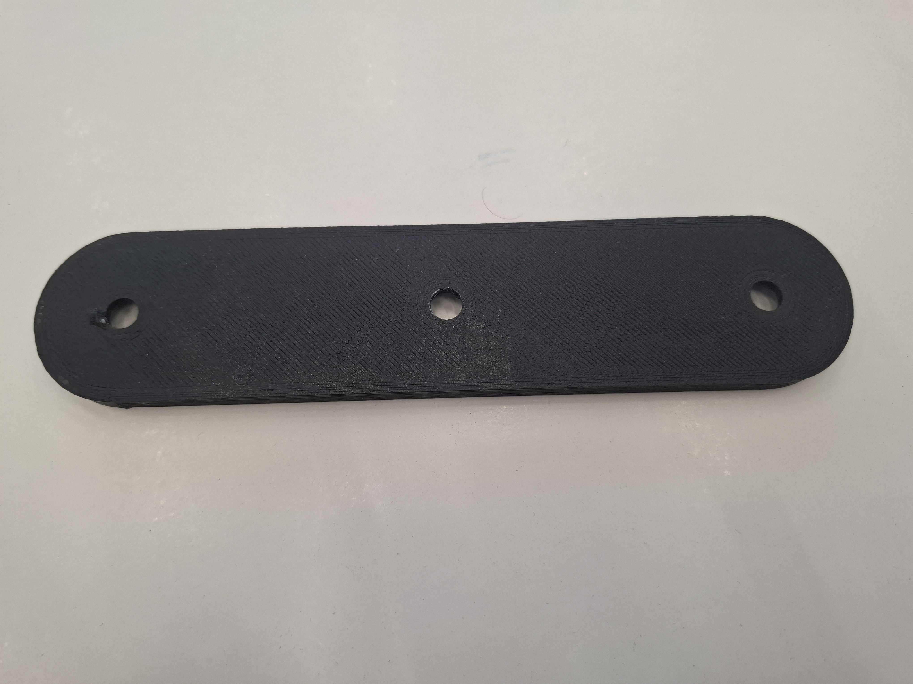

# Работа Корепановой Анны
# Проект "Лазерная установка двойного наведения" на языке OpenScad

Модель для 3D-печати пластины, которая закрепляется на штативе с винтом 1/4". На устанавливаются две лазерные указки с помощью винтов и гаек также с диаметром резьбы 1/4".

Модели кронштейнов для лазерных указок:
[Модель в формате OpenScad](https://github.com/ifizmat/laser-holder) в репозитории на GitHub laser-holder.

# Фотографии напечатанной модели

# Фотографии установки  

# Обновленная модель
